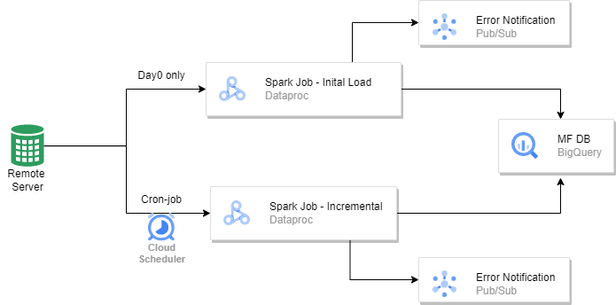
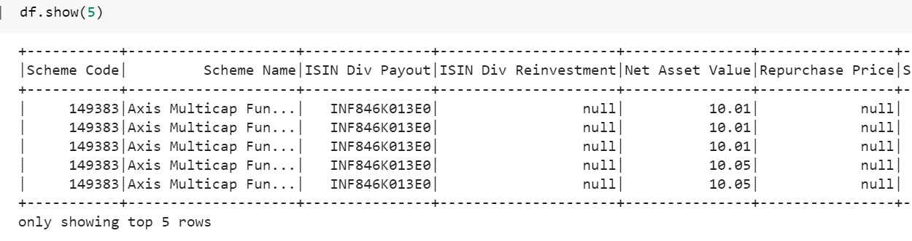

## Mutual fund data load pipeline

This repository has data load for a sample 'mutual fund type- 
Axis Mutual Fund' but code base is generic, so it can applicable for all fund types.

## Design

- GCS - Staging area for raw file storage 
- Bigquery - Database/ Data warehouse for MF data
- Cloud Scheduler - Cron job resource for daily run the incremental job
- Data proc - To run spark job 
- Pubsub - pubsub topic for failure notifications

### For incremental load -
- Bigquery has control table consists last upload date and max date in the uploaded data,
that would be use for next run.

It consists -
 - Initial Load
 - Daily/incremental Load

Spark has been used for faster data movement. 

Following is the structure - 
* fund_extract.py - file consists code to extract data from source server
* initial_load_spark.py - file consist for initial ingestion data to db (bigquery)
* incremental_load_spark.py - file for daily data ingestion, lookup with bq table to get last upload date (max date) and refer delta records to uplaod
* requirement.txt - requirement to install
* utils.py - file consist all utility function for the code
* developement-notebook - server_request.ipynb - for initial developement google notebook with output results for reference
* spark_bq_fund.ipynb - spark developed code on colab notebook.

## artifacts for reference
### sample-data-snippet for db upload

Please note developement_notebook has tested code with artifacts.
